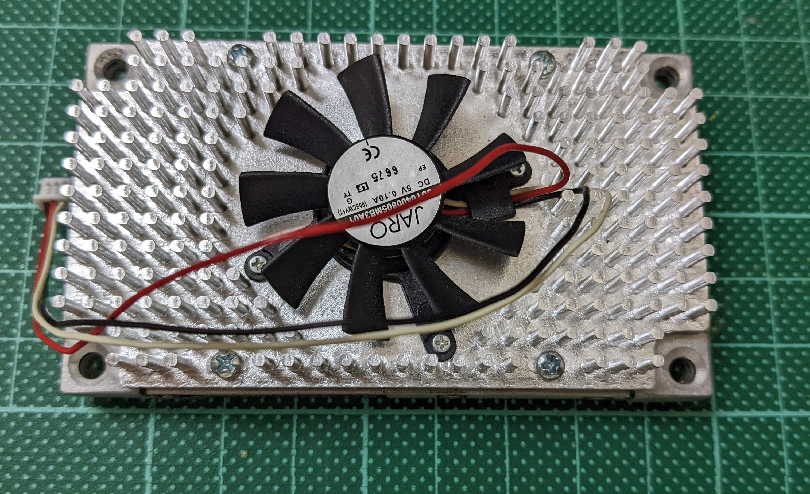

## Istructions for setting up hardware and Sofwtwar on nvidia Jetson

Nvidia Software developer kit (SDK) is called Jetpack and can be found [here](https://developer.nvidia.com/embedded/jetpack). 

There are a number of different methods for setting up Nvidia devices and there is also dependency between host device and version of Jetpack being flashed. 

for Nvidia tx_2 and Auvidea J120 carrier board it is necessary to have linux Ubuntu 18.04 LTS and have Nvidia SDKManager (earlier version of jetpack). 

- 1 Running flash.sh from downloaded nvidia directory
- 2 Using Nvidia's SDK manager UI
- 3 Using Nvidia SDKManager CLI

Auvidea provide a patch for some carrier boards and issue specific instructions, 

for example the J120 the working method is to download patches,
move these into Nvidia directory and flash using shell script (flash.sh).

The Nvidia jetson Nano looks like this, well inside an aluminum protection and cooling case:

from the side:

From the top:

This is unmounted and on the bottom you can see the (peripheral component interconnect express)pcie slots 

The Auvdea is a german mad base board, the Jetson has jetpack (linux os) pre installed and has a different setup process to other single board computers. Base board is support. 

The setup unlike other single board does not require flashing an ssd or 2m 
physical setup, 

attache the jetson nano via pcie lanes and screw together, connect fan JST (Japan Solderless Terminal) micro 1.25mm pitch connector (4 pin)
connect micro hdmi,
connect usb bluetooth mouse, keyboard adaptor. 

The system automatically boots, debugging any issues with this need to happen with a ttl converter Universal Asynchronos Receiver/Transmitter UART output. 

full technical details can be found [here](https://auvidea.eu/download/manual/J120/J120_J121_technical_reference_2.0.pdf)

Software setup:

This is far simpler and requires simply booting, NVIDIA's own os loads, My own preference is for headless setups however however given pre installed UI is present and flashing the drive is more complex than other single board setups it is easier to proceed with the system as is and then ssh into a headless boot. 

